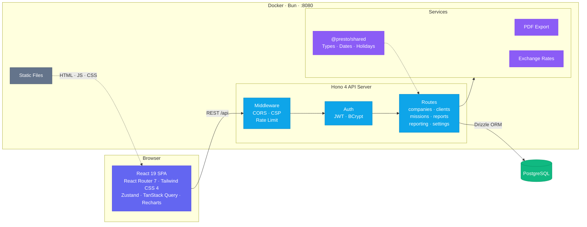

# Contributing to Presto

Thanks for your interest in contributing! Here's how to get started.

## Prerequisites

- [Bun](https://bun.sh/) (latest)
- [Docker](https://www.docker.com/) (for PostgreSQL)

## Development Setup

```bash
git clone https://github.com/tux86/presto.git
cd presto
bun install
cp .env.example .env
# Edit .env: set POSTGRES_PASSWORD and JWT_SECRET (min 32 chars)
docker compose up -d
bun run db:migrate
bun run db:seed
bun run dev
```

This starts the backend (hot reload) on `http://localhost:3001`, the frontend (Vite HMR) on `http://localhost:5173`, and [Drizzle Studio](https://local.drizzle.studio) (database explorer). The frontend proxies `/api` requests to the backend.

### Commands

```bash
bun run dev              # Start backend + frontend
bun run dev:backend      # Backend only
bun run dev:frontend     # Frontend only
bun run build            # Production build (all packages)
bun run typecheck        # Type-check all packages
bun run lint             # Lint + format check (Biome)
bun run lint:fix         # Auto-fix lint + format
bun run db:generate      # Generate Drizzle migration SQL from schema changes
bun run db:migrate       # Apply pending migrations (programmatic, runs at startup too)
bun run db:studio        # Open Drizzle Studio (DB explorer)
bun run db:seed          # Seed sample data
bun run test             # Run API E2E tests (requires presto_test PostgreSQL DB)
```

## Testing

API E2E tests use Bun's test runner with Hono's `app.request()` for in-process HTTP testing — no running server needed. Tests run against an isolated `presto_test` PostgreSQL database.

### One-time setup

```bash
# Create the test database
docker exec -it presto-postgres psql -U presto -c "CREATE DATABASE presto_test;"

# Create .env.test from the example
cp packages/backend/.env.test.example packages/backend/.env.test
# Edit packages/backend/.env.test: set the password to match your .env POSTGRES_PASSWORD
```

### Running tests

```bash
bun run test
```

Tests automatically run Drizzle migrations and truncate all tables before each run, so your dev database is never affected.

## Architecture



Presto ships as a **single Docker image** running on [Bun](https://bun.sh/). The Hono backend serves both the REST API and the pre-built React frontend as static files. All data stays on your server.

## Project Structure

Presto is a Bun monorepo with three packages.

```
packages/
├── backend/                  # @presto/backend — Hono API server
│   ├── src/
│   │   ├── app.ts            # Hono app, route registration
│   │   ├── index.ts          # Server entry point
│   │   ├── lib/config.ts     # Environment variable configuration
│   │   └── routes/           # auth, companies, clients, missions, activity-reports, reporting, settings
│   │   └── db/               # Drizzle ORM schema, migrations, helpers
│   │       ├── schema/       # pg.schema.ts
│   │       └── migrations/   # pg/ migration SQL
├── frontend/                 # @presto/frontend — React SPA
│   └── src/
│       ├── App.tsx           # Route definitions
│       ├── pages/            # Dashboard, ActivityReportEditor, Clients, Companies, Missions, Reporting, Login
│       ├── components/       # Shared UI components
│       ├── stores/           # Zustand state stores
│       ├── hooks/            # Custom hooks (useIsMobile, etc.)
│       └── i18n/             # Translation files (en, fr, de, es, pt)
└── shared/                   # @presto/shared — Shared types and utilities
    └── src/
        └── index.ts
```

## Environment Variables

Copy `.env.example` to `.env` and fill in the required values (`JWT_SECRET` must be at least 32 characters, `POSTGRES_PASSWORD` must be set).

### Database

| Variable | Default | Description |
|---|---|---|
| `POSTGRES_USER` | `presto` | PostgreSQL username |
| `POSTGRES_PASSWORD` | **required** | PostgreSQL password |
| `POSTGRES_DB` | `presto` | PostgreSQL database name |
| `POSTGRES_PORT` | `5432` | Host port mapped to PostgreSQL |
| `DATABASE_URL` | _(constructed)_ | Full database connection string |

### Backend

| Variable | Default | Description |
|---|---|---|
| `PORT` | `3001` | Backend HTTP port |
| `JWT_SECRET` | **required** (min 32 chars) | Secret for signing JWT tokens |
| `AUTH_DISABLED` | `false` | Set `true` to disable authentication (single-user mode) |
| `REGISTRATION_ENABLED` | `true` | Enable/disable user registration |
| `CORS_ORIGINS` | `http://localhost:5173` | Allowed CORS origins (comma-separated) |
| `APP_NAME` | `Presto` | Application name in public config API |
| `DEFAULT_THEME` | `dark` | Default theme for new users (`light`, `dark`, `auto`) |
| `DEFAULT_LOCALE` | `en` | Default locale for new users (`en`, `fr`, `de`, `es`, `pt`) |
| `DEFAULT_BASE_CURRENCY` | `EUR` | Default base currency for new users (ISO 4217) |
| `DEFAULT_USER_EMAIL` | `admin@localhost` | Default admin email |
| `DEFAULT_USER_PASSWORD` | _(empty)_ | Default admin password |
| `RATE_LIMIT_MAX` | `20` | Max auth requests per IP per window (`0` to disable) |
| `RATE_LIMIT_WINDOW_MS` | `900000` | Rate limit window in ms (default: 15 min) |

### Docker (Production)

| Variable | Default | Description |
|---|---|---|
| `PORT` | `8080` | Host port for the Presto container |
| `POSTGRES_PASSWORD` | **required** | PostgreSQL password (no default in production) |
| `JWT_SECRET` | **required** | JWT signing secret (no default in production) |

## API Routes

All routes are prefixed with `/api`.

| Route | Description |
|---|---|
| `GET /api/health` | Health check — returns `{ status: "ok" }` |
| `GET /api/config` | Public configuration (app name, theme, locale, auth status) |
| `/api/auth/*` | Login, register, and current user (`/me`) |
| `/api/companies/*` | CRUD for companies (user's legal entities) |
| `/api/clients/*` | CRUD for clients |
| `/api/missions/*` | CRUD for missions (linked to clients) |
| `/api/activity-reports/*` | CRUD for monthly activity reports, PDF export |
| `/api/reporting/*` | Aggregated reporting and analytics data |
| `/api/settings` | User preferences (theme, locale, baseCurrency) |

Authentication uses JWT bearer tokens. When `AUTH_DISABLED=true`, all protected endpoints are accessible without a token.

## Branch Strategy

- Create feature branches from `main`
- Use descriptive branch names: `feat/add-export-csv`, `fix/login-redirect`

## Commit Convention

This project uses [Conventional Commits](https://www.conventionalcommits.org/) enforced by commitlint.

```
feat: add CSV export for activity reports
fix: correct date calculation for leap years
chore: update dependencies
docs: improve API reference section
refactor: extract shared date utilities
```

A pre-commit hook runs Biome to auto-format staged files. A commit-msg hook validates the message format.

## Code Style

- **Formatter/Linter:** [Biome](https://biomejs.dev/) (configured in `biome.json`)
- Double quotes, semicolons, trailing commas, 2-space indent, 120 char line width
- Run `bun run lint` to check, `bun run lint:fix` to auto-fix

## Pull Requests

1. Keep PRs focused on a single change
2. Fill out the PR template
3. Ensure CI passes (lint, typecheck, build, test)
4. Describe how to test your changes

## Reporting Issues

Use the [issue templates](https://github.com/tux86/presto/issues/new/choose) for bug reports and feature requests.
