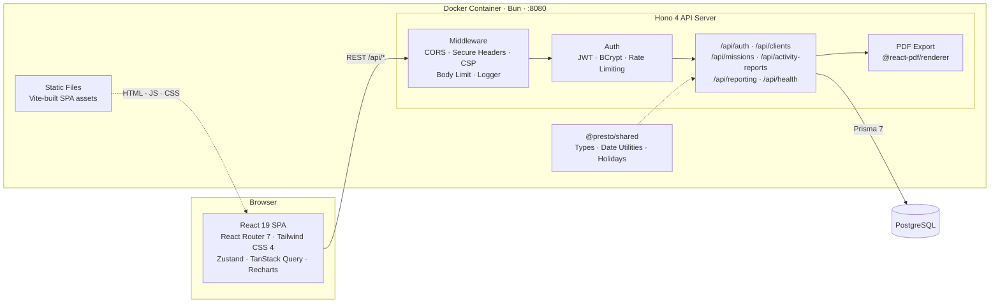

<div align="center">
  

  <h1>Presto</h1>

  <p><strong>Self-hosted time tracking for freelancers and consultants.</strong><br/>
  Generate monthly activity reports, track clients and missions, and export everything as PDF.</p>

  [](https://github.com/tux86/presto/actions/workflows/ci.yml)
  [](https://github.com/tux86/presto/releases)
  [](https://hub.docker.com/r/axforge/presto)
  [](LICENSE)
</div>

<br/>

<p align="center">
  
</p>
<p align="center">
  
</p>
<p align="center">
  
</p>

## Why Presto?

Most time-tracking tools are built for teams. Presto is built for **independent freelancers** who need one thing: a clean monthly activity report they can send to their client.

- **Single Docker image** — no separate frontend/backend/worker containers to manage
- **PDF-ready activity reports** — calendar view with billable days, ready to print or email
- **Works without auth** — disable login for single-user setups, no account needed
- **Your data, your server** — fully self-hosted, no cloud dependency, MIT licensed

## Features

| | |
|---|---|
| Monthly activity reports | Calendar-based day tracking per mission |
| Client & mission management | Organize work across multiple clients |
| PDF export | Professional, print-ready reports via @react-pdf/renderer |
| Revenue dashboards | Visual charts for activity and revenue analysis |
| Dark mode | System-aware theme with manual override |
| i18n | French (default) and English |
| Responsive | Mobile, tablet, and desktop layouts |
| Multi-database | PostgreSQL, MySQL, SQLite, SQL Server, CockroachDB |

## Quick Start

```bash
curl -O https://raw.githubusercontent.com/tux86/presto/main/docker-compose.production.yml

# Required: set secrets before starting
export POSTGRES_PASSWORD="$(openssl rand -base64 32)"
export JWT_SECRET="$(openssl rand -base64 48)"

docker compose -f docker-compose.production.yml up -d
```

Open [http://localhost:8080](http://localhost:8080).

See the [Docker Hub page](https://hub.docker.com/r/axforge/presto) for environment variables, `docker run`, and configuration options.

## Architecture



Presto ships as a **single Docker image** running on [Bun](https://bun.sh/). The Hono backend serves both the REST API and the pre-built React frontend as static files. All data stays on your server.

**Built with** TypeScript, React 19, Hono 4, Prisma 7, Vite 6, Tailwind CSS 4, Recharts, and Bun.

## Comparison

| Feature | Presto | Kimai | Traggo | Wakapi |
|---|:---:|:---:|:---:|:---:|
| Single Docker image | Yes | No | Yes | Yes |
| Monthly activity reports | Yes | No | No | No |
| PDF export | Yes | Yes | No | No |
| Multi-database | Yes | No | No | Yes |
| Optional auth (single-user) | Yes | No | No | No |
| i18n (FR + EN) | Yes | Yes | No | No |
| Client/mission tracking | Yes | Yes | No | No |
| Revenue dashboards | Yes | Yes | No | No |

## Development

See [CONTRIBUTING.md](CONTRIBUTING.md) for local development setup, project structure, and guidelines.

## License

[MIT](LICENSE)
