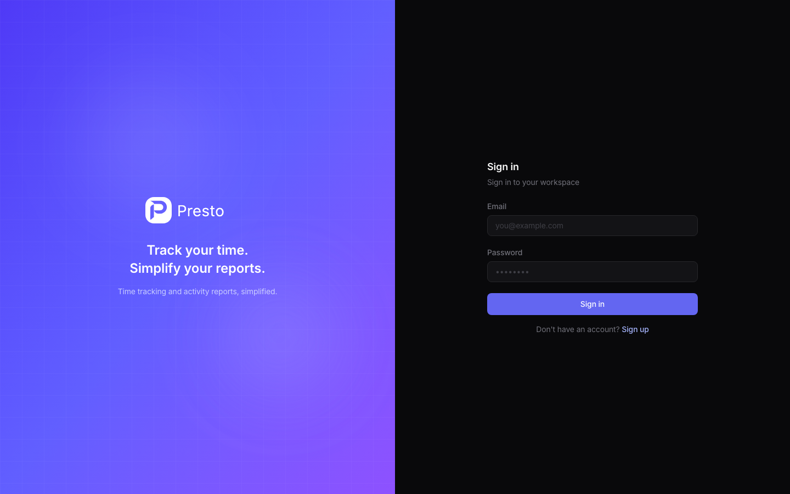
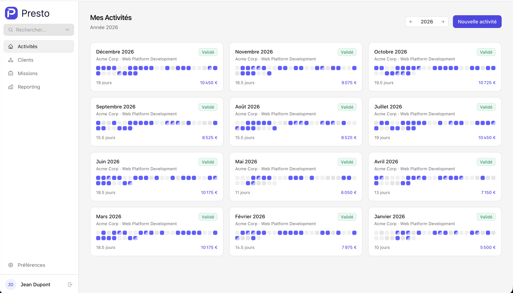
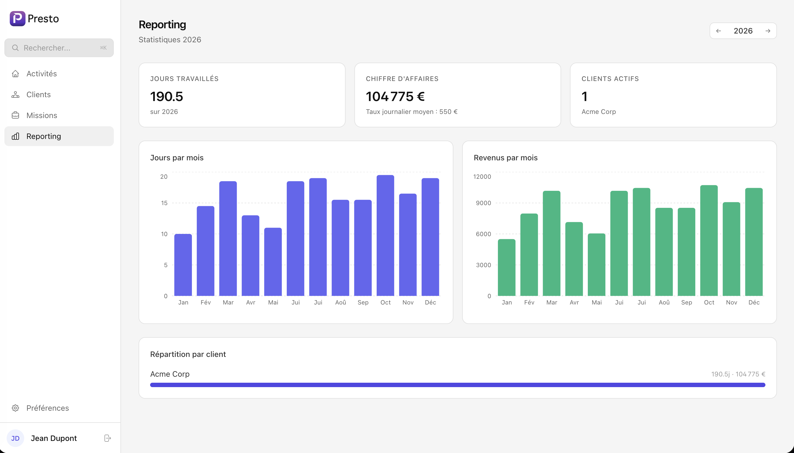
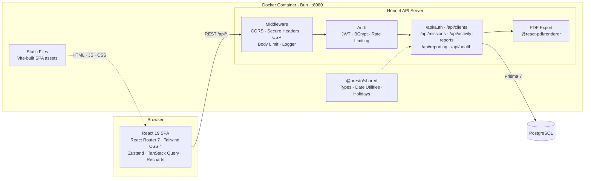

<div align="center">
  

  <h1>Presto</h1>

  <p><strong>Self-hosted time tracking for freelancers and consultants.</strong><br/>
  Generate monthly activity reports, track clients and missions, and export everything as PDF.</p>

  [](https://github.com/tux86/presto/actions/workflows/ci.yml)
  [](https://github.com/tux86/presto/actions/workflows/ci.yml)
  [](https://github.com/tux86/presto/releases)
  [](https://hub.docker.com/r/axforge/presto)
  [](LICENSE)
  [](https://www.typescriptlang.org/)
  [](https://bun.sh/)
</div>

<br/>

<p align="center">
  
</p>
<p align="center">
  
</p>
<p align="center">
  
</p>

## Why Presto?

Most time-tracking tools are built for teams. Presto is built for **independent freelancers** who need one thing: a clean monthly activity report they can send to their client.

- **Single Docker image** — no separate frontend/backend/worker containers to manage
- **PDF-ready activity reports** — calendar view with billable days, ready to print or email
- **Works without auth** — disable login for single-user setups, no account needed
- **Your data, your server** — fully self-hosted, no cloud dependency, MIT licensed

## Features

### Activity Reports
- Calendar-based day tracking with **half-day precision** (0, 0.5, or 1 per day)
- **Auto-fill workdays** — one click fills all weekdays, skipping weekends and public holidays
- **Country-specific holidays** — per-client holiday calendar (all countries supported via `date-holidays`)
- **Draft / Completed workflow** — lock reports to prevent accidental edits
- Report notes for delivery comments or internal tracking
- Clear all entries or revert completed reports back to draft

### Client & Mission Management
- Organize work by **client** and **mission** (project)
- Per-client **currency** (all ISO 4217 currencies) and **holiday country**
- Optional fields: email, phone, address, business ID (SIRET, VAT, etc.)
- Daily rate tracking per mission with date ranges
- Active/inactive mission status

### PDF Export
- Professional, print-ready reports generated server-side via `@react-pdf/renderer`
- Bilingual output — export in **French** or **English**
- Includes client info, mission name, calendar grid, totals, and notes
- Filename auto-generated from client, mission, and period

### Revenue Dashboards
- Yearly overview with **total days**, **total revenue**, and **average daily rate**
- Monthly breakdown charts (days worked + revenue per month)
- Per-client revenue distribution
- Built with Recharts

### Authentication & Security
- **Optional** — disable for single-user setups (`AUTH_ENABLED=false`)
- JWT-based auth with configurable expiry
- User registration with password policies (min 8 chars, uppercase, lowercase, digit)
- Registration can be disabled after initial setup (`REGISTRATION_ENABLED=false`)
- Per-IP rate limiting on auth endpoints
- Secure headers (CSP, HSTS) and CORS configuration
- Multi-user with full data isolation (ownership checks on all resources)

### User Experience
- **Dark mode** — system-aware with manual override
- **Bilingual** — French and English (locale toggle)
- **Responsive** — mobile (375px+), tablet (768px+), and desktop (1024px+)
- Searchable select components for clients and missions
- Dashboard filters by client and mission

### Deployment
- **Single Docker image** — backend + frontend served together
- Auto-runs database migrations on startup
- Built-in health check endpoint (`/api/health`)
- **Multi-database** — PostgreSQL (default), MySQL, SQLite, SQL Server, CockroachDB via Prisma provider swap

## Quick Start

```bash
curl -O https://raw.githubusercontent.com/tux86/presto/main/docker-compose.production.yml

# Required: set secrets before starting
export POSTGRES_PASSWORD="$(openssl rand -base64 32)"
export JWT_SECRET="$(openssl rand -base64 48)"

docker compose -f docker-compose.production.yml up -d
```

Open [http://localhost:8080](http://localhost:8080).

See the [Docker Hub page](https://hub.docker.com/r/axforge/presto) for environment variables, `docker run`, and configuration options.

## Tech Stack

| Layer | Technologies |
|---|---|
| **Runtime** | [Bun](https://bun.sh/) |
| **Frontend** | React 19, Vite 6, Tailwind CSS 4, Zustand, TanStack Query, React Router 7, Recharts |
| **Backend** | Hono 4, Prisma 7, @react-pdf/renderer |
| **Database** | PostgreSQL 16 (default) |
| **Language** | TypeScript 5.7 (strict mode) |
| **Testing** | Bun test runner, Hono `app.request()` (101 E2E tests) |
| **CI/CD** | GitHub Actions (lint, typecheck, build, test), semantic-release |

## Architecture



Presto ships as a **single Docker image** running on [Bun](https://bun.sh/). The Hono backend serves both the REST API and the pre-built React frontend as static files. All data stays on your server.

## Comparison

| Feature | Presto | Kimai | Traggo | Wakapi |
|---|:---:|:---:|:---:|:---:|
| Single Docker image | Yes | No | Yes | Yes |
| Monthly activity reports | Yes | No | No | No |
| PDF export | Yes | Yes | No | No |
| Multi-database | Yes | No | No | Yes |
| Optional auth (single-user) | Yes | No | No | No |
| i18n (FR + EN) | Yes | Yes | No | No |
| Client/mission tracking | Yes | Yes | No | No |
| Revenue dashboards | Yes | Yes | No | No |
| Holiday-aware calendars | Yes | No | No | No |
| Half-day precision | Yes | No | No | No |

## Development

See [CONTRIBUTING.md](CONTRIBUTING.md) for local setup, project structure, environment variables, and guidelines.

```bash
git clone https://github.com/tux86/presto.git
cd presto
bun install
cp .env.example .env          # edit: set POSTGRES_PASSWORD + JWT_SECRET
docker compose up -d           # start PostgreSQL
bun run db:migrate && bun run db:generate
bun run dev                    # http://localhost:5173
```

### Testing

101 API E2E tests using Bun's test runner with Hono's `app.request()` — no running server needed.

```bash
bun run test
```

## License

[MIT](LICENSE)
