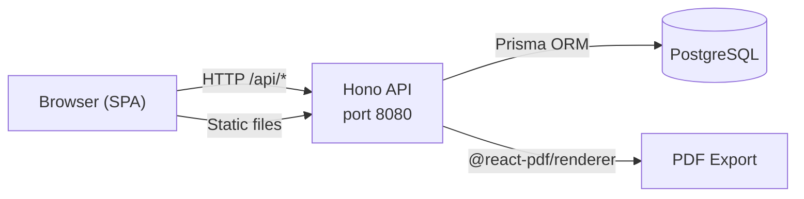

<div align="center">
  

  <h1>Presto</h1>

  <p>A self-hosted time-tracking application for freelancers and consultants.<br/>
  Generate monthly activity reports and export them as PDF.</p>

  [](https://github.com/tux86/presto/actions/workflows/ci.yml)
  [](https://github.com/tux86/presto/releases)
  [](https://github.com/tux86/presto/pkgs/container/presto)
  [](LICENSE)

  [](https://www.typescriptlang.org/)
  [](https://bun.sh/)
  [](https://react.dev/)
  [](https://hono.dev/)
  [](https://www.prisma.io/)
  [](https://www.postgresql.org/)
</div>

<br/>

<p align="center">
  
</p>

---

## Features

- **Activity report management** — Create and edit monthly activity reports, log billable and non-billable days per mission
- **Client and mission tracking** — Organize work across multiple clients and concurrent missions
- **PDF export** — Generate professional, print-ready activity report PDFs via `@react-pdf/renderer`
- **Reporting** — Visual dashboards with charts (Recharts) for activity and revenue analysis
- **French and English i18n** — Full interface localization, French by default
- **Dark mode** — System-aware theme with manual override
- **Responsive design** — Mobile (375px+), tablet (768px+), and desktop (1024px+) layouts
- **Optional authentication** — JWT-based auth that can be disabled for single-user deployments
- **Database flexibility** — PostgreSQL by default; swap to MySQL, SQLite, SQL Server, or CockroachDB via Prisma

---

## Tech Stack

| Layer | Technology | Version |
|---|---|---|
| Runtime | Bun | latest |
| Frontend framework | React | ^19.0.0 |
| Build tool | Vite | ^6.1.0 |
| CSS | Tailwind CSS | ^4.0.0 |
| State management | Zustand | ^5.0.0 |
| Server state | TanStack Query | ^5.66.0 |
| Routing | React Router | ^7.2.0 |
| Charts | Recharts | ^2.15.0 |
| API framework | Hono | ^4.7.0 |
| ORM | Prisma | ^7.4.1 |
| PDF generation | @react-pdf/renderer | ^4.3.0 |
| Database | PostgreSQL | 16 |
| Language | TypeScript | ^5.7.0 |

---

## Quick Start with Docker

The fastest way to run Presto is with Docker Compose. All three services (PostgreSQL, backend, frontend) start together.

**1. Clone the repository**

```bash
git clone https://github.com/tux86/presto.git
cd presto
```

**2. Configure environment variables**

```bash
cp .env.example .env
```

Edit `.env` and set a strong `JWT_SECRET` before running in any non-local environment. All other defaults work out of the box.

**3. Start all services**

```bash
docker-compose up -d
```

The frontend will be available at [http://localhost:8080](http://localhost:8080).

Default credentials (when `AUTH_ENABLED=true`): `admin@localhost` with the password set via `DEFAULT_USER_PASSWORD`.

---

## Local Development

Use this setup when contributing to or extending Presto.

**Prerequisites**

- [Bun](https://bun.sh/) (latest)
- [Docker](https://www.docker.com/) (for PostgreSQL)

**1. Clone and install dependencies**

```bash
git clone https://github.com/tux86/presto.git
cd presto
bun install
```

**2. Configure environment variables**

```bash
cp .env.example .env
```

**3. Start the database**

```bash
docker-compose up -d postgres
```

**4. Run database migrations and seed sample data**

```bash
bun run db:migrate
bun run db:seed
```

**5. Start the development servers**

```bash
bun run dev
```

This starts both the backend (hot reload) on `http://localhost:3001` and the frontend on `http://localhost:5173`. The frontend proxies all `/api` requests to the backend.

**Individual package commands**

```bash
bun run dev:backend     # Backend only (hot reload via --hot)
bun run dev:frontend    # Frontend only (Vite HMR)
bun run build           # Production build for all packages
bun run db:generate     # Regenerate Prisma client after schema changes
bun run db:migrate      # Apply pending migrations
bun run db:seed         # Seed the database with sample data
```

---

## Project Structure

Presto is a Bun monorepo with three packages.

```
presto/
├── docker-compose.yml
├── .env.example
├── package.json                  # Root workspace and scripts
└── packages/
    ├── backend/                  # @presto/backend
    │   ├── src/
    │   │   ├── app.ts            # Hono app, route registration
    │   │   ├── index.ts          # Server entry point
    │   │   ├── lib/
    │   │   │   └── config.ts     # Environment variable configuration
    │   │   └── routes/           # auth, clients, missions, activity-reports, reporting
    │   └── prisma/
    │       └── schema.prisma     # Database schema
    ├── frontend/                 # @presto/frontend
    │   └── src/
    │       ├── App.tsx           # Route definitions
    │       ├── pages/            # Dashboard, ActivityReportEditor, Clients, Missions, Reporting, Login
    │       ├── components/       # Shared UI components
    │       ├── stores/           # Zustand state stores
    │       ├── hooks/            # Custom hooks (useIsMobile, etc.)
    │       └── i18n/             # French and English translation files
    └── shared/                   # @presto/shared
        └── src/
            └── index.ts          # Shared TypeScript types and utilities
```

---

## Environment Variables

Copy `.env.example` to `.env` and adjust values as needed.

### Database

| Variable | Default | Description |
|---|---|---|
| `POSTGRES_USER` | `presto` | PostgreSQL username |
| `POSTGRES_PASSWORD` | `presto_dev_password` | PostgreSQL password |
| `POSTGRES_DB` | `presto` | PostgreSQL database name |
| `POSTGRES_PORT` | `5432` | Host port mapped to PostgreSQL |
| `DATABASE_URL` | _(constructed)_ | Full Prisma connection string — required by the backend |

### Backend

| Variable | Default | Description |
|---|---|---|
| `PORT` | `3001` | Backend HTTP port |
| `JWT_SECRET` | `change-me-in-production` | Secret used to sign JWT tokens — **change this** |
| `AUTH_ENABLED` | `true` | Enable or disable authentication (`true` / `false`) |
| `CORS_ORIGINS` | `http://localhost:5173` | Comma-separated list of allowed CORS origins |
| `APP_NAME` | `Presto` | Application name exposed in the public config API |
| `APP_THEME` | `light` | Default theme (`light` or `dark`) |
| `APP_LOCALE` | `fr` | Default locale (`fr` or `en`) |
| `APP_CURRENCY` | `EUR` | Currency used in reports |
| `DEFAULT_USER_EMAIL` | `admin@localhost` | Email for the default admin user |
| `DEFAULT_USER_PASSWORD` | _(empty)_ | Password for the default admin user |
| `DEFAULT_USER_FIRST_NAME` | `Admin` | First name for the default admin user |
| `DEFAULT_USER_LAST_NAME` | _(empty)_ | Last name for the default admin user |

### Docker Compose (frontend)

| Variable | Default | Description |
|---|---|---|
| `BACKEND_PORT` | `3001` | Host port mapped to the backend container |
| `FRONTEND_PORT` | `8080` | Host port mapped to the frontend container |

---

## API Reference

All routes are prefixed with `/api`.

| Route | Description |
|---|---|
| `GET /api/health` | Health check — returns `{ status: "ok" }` |
| `GET /api/config` | Public configuration (app name, theme, locale, auth status) |
| `/api/auth/*` | Login, logout, and current user (`/me`) |
| `/api/clients/*` | CRUD for clients |
| `/api/missions/*` | CRUD for missions (linked to clients) |
| `/api/activity-reports/*` | CRUD for monthly activity reports, PDF export |
| `/api/reporting/*` | Aggregated reporting and analytics data |

Authentication uses JWT bearer tokens. When `AUTH_ENABLED=false`, all protected endpoints are accessible without a token.

---

## Switching Databases

Presto's Prisma schema uses only cross-database compatible field types. To use a different database engine, update the `provider` in `packages/backend/prisma/schema.prisma` and set `DATABASE_URL` to the appropriate connection string.

Supported providers: `postgresql`, `mysql`, `sqlite`, `sqlserver`, `cockroachdb`.

---

## Architecture



Presto ships as a single Docker image. The Hono backend serves both the API and the pre-built React frontend as static files.

---

## Comparison with Alternatives

| Feature | Presto | Kimai | Traggo | Wakapi |
|---|:---:|:---:|:---:|:---:|
| Self-hosted | Yes | Yes | Yes | Yes |
| Single Docker image | Yes | No | Yes | Yes |
| Monthly activity reports | Yes | No | No | No |
| PDF export | Yes | Yes | No | No |
| Multi-database support | Yes | No | No | Yes |
| Optional auth (single-user) | Yes | No | No | No |
| i18n (FR + EN) | Yes | Yes | No | No |
| Lightweight (Bun runtime) | Yes | No | No | Yes |
| Client/mission tracking | Yes | Yes | No | No |
| Revenue dashboards | Yes | Yes | No | No |

---

## Contributing

Contributions are welcome! See [CONTRIBUTING.md](CONTRIBUTING.md) for guidelines.

---

## License

This project is licensed under the [MIT License](LICENSE).
