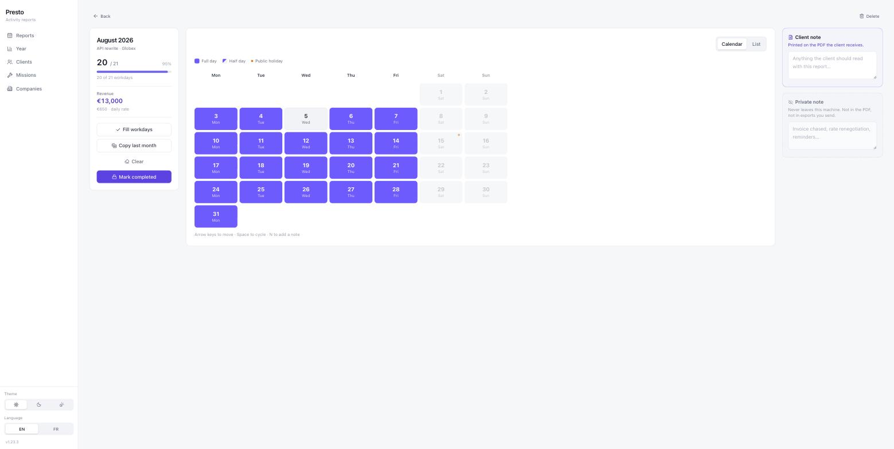
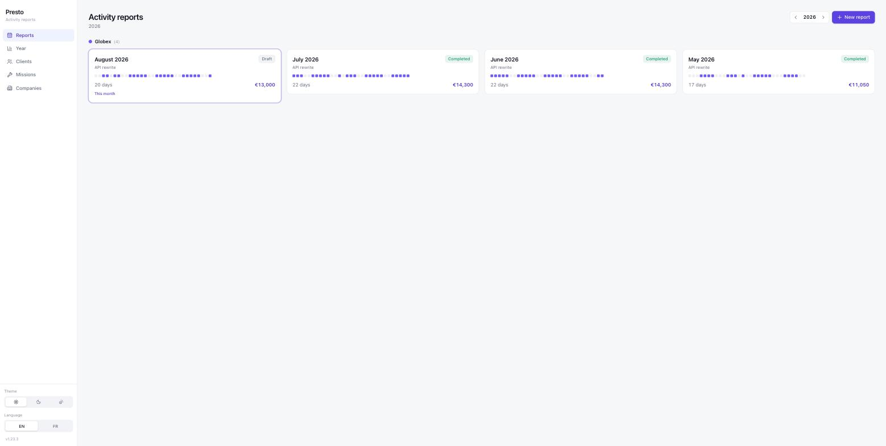
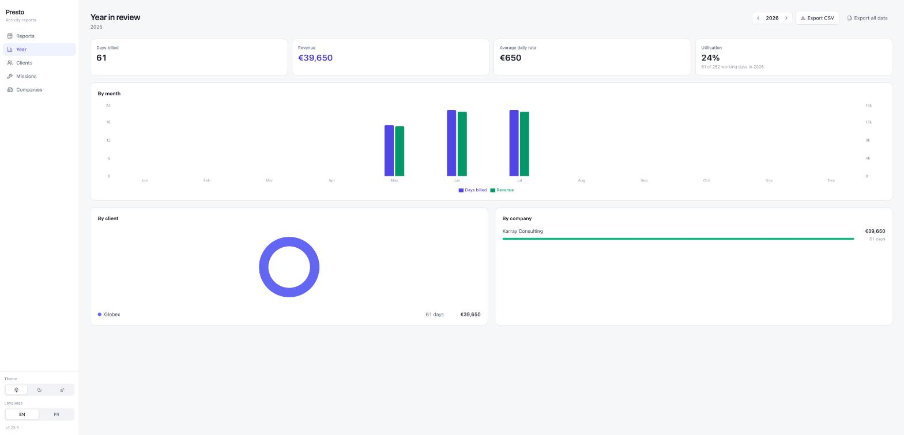

<div align="center">
  

  <h1>Presto</h1>

  <p><strong>Monthly activity reports for freelancers and consultants.</strong><br/>
  Track billable days on a calendar, hand your client a clean PDF.</p>

  <p>
    <a href="https://github.com/tux86/presto/actions/workflows/ci.yml"></a>
    <a href="https://github.com/tux86/presto/releases"></a>
    <a href="LICENSE"></a>
  </p>
</div>

<p align="center">
  
</p>

---

## What it is

A *compte rendu d'activité* generator. You mark the days you worked on a calendar, and Presto turns
the month into a PDF your client can accept, plus a yearly view of days and revenue.

It is built for **one person on one machine**. There are no accounts, no login, no cloud, no
telemetry. Your data is one SQLite file you can copy, move, and back up yourself.

> [!IMPORTANT]
> **Presto has no authentication.** Anyone who can reach the port can read and change everything.
> Run it on `localhost`, or behind a reverse proxy, VPN, or Tailscale that handles access control.
> Do not put it on a public port.

## Quick start

```bash
git clone https://github.com/tux86/presto.git
cd presto
bun install
bun start
```

Open <http://localhost:3001>. That is the whole setup — no database to provision, no `.env` to fill
in. Your data lands in `./data/presto.db`.

You need [Bun](https://bun.sh) 1.2 or newer. Nothing else.

### Docker

```bash
docker run -d --name presto \
  -p 127.0.0.1:8080:8080 \
  -v presto-data:/data \
  ghcr.io/tux86/presto:latest
```

Or with the bundled Compose file:

```bash
curl -O https://raw.githubusercontent.com/tux86/presto/main/docker-compose.yml
docker compose up -d
```

One container, one volume. There is no database container, because the database is a file.

## Using it

**Set up, once.** Rename the starter company under **Companies** to your legal entity — the name
that appears on the PDF. Add a **client** (currency and holiday country live here), then a
**mission** for the work you do for them, with its daily rate.

**Every month.** Create a report for a mission and month. Fill it in:

- Click a day to cycle it through **empty → half day → full day**
- **Fill workdays** marks every weekday, skipping weekends and that client's public holidays
- **Copy last month** reuses *which weekdays* you worked, re-applied to this month's calendar
- Arrow keys move, <kbd>Space</kbd> cycles, <kbd>N</kbd> jumps to the day's note

**When it's done.** Mark the report **completed** — it becomes read-only — and export the PDF.
Reverting to draft is possible but asks first, because your client may already have a copy.

Two notes per report, and the difference matters:

| | Where it goes |
|---|---|
| **Client note** | Printed on the PDF the client receives |
| **Private note** | Stays in your database. Never in the PDF, never in a client-facing export |

<p align="center">
  
</p>

**At year end.** The **Year** page shows days billed, revenue, average daily rate, and utilisation
against the working days in the year, with a breakdown per client and per company. Export the whole
year as CSV for your accountant, or the whole database as JSON.

<p align="center">
  
</p>

If you bill in more than one currency, amounts are shown **per currency** and never converted.
Presto does not know today's exchange rate and will not pretend to.

## Configuration

Everything is optional.

| Variable | Default | What it does |
|---|---|---|
| `PORT` | `3001` (`8080` in Docker) | HTTP port |
| `DATA_DIR` | `./data` (`/data` in Docker) | Where `presto.db` lives |
| `APP_NAME` | `Presto` | Name shown in the sidebar |

Theme (light / dark / auto) and language (English / French) are per-browser settings in the sidebar,
not environment variables.

## Backups

```bash
cp data/presto.db ~/backups/presto-$(date +%F).db
```

That is a complete backup. To move to another machine, copy the file. The **Year** page also exports
everything as JSON if you want a format you can read without SQLite.

## Coming from v1

Presto v1 stored data in PostgreSQL and had optional multi-user accounts. v2 drops both. To bring
your data across:

1. Start Presto v1 and use **Profile → Export all data** to download the JSON
2. `bun run import:v1 presto-v1-export.json`

Add `--dry-run` first to see what it would write. The import refuses to run against a database that
already has data.

v1 remains available at the [`v1-final`](https://github.com/tux86/presto/tree/v1-final) tag.

## Development

```bash
bun install
bun run dev            # API on :3001, Vite with HMR on :5173
bun test               # ~150 tests, no database or server needed
bun run typecheck
bun run lint:fix
bun run seed --reset   # fill the database with a plausible two-year history
```

`bun run seed` is for trying Presto out and for working on it — two entities, four
clients in two currencies, and a couple of years of months. It is deterministic, so the
same command always produces the same data. It is never run automatically and is not in
the Docker image; Presto has no demo mode.

### How it fits together

```
src/
  core/    pure logic — calendars, holidays, totals, yearly rollup, CSV
  db/      SQLite schema, migrations, queries
  pdf/     the document your client receives
  server/  Hono routes, static file serving
  ui/      React app
  i18n/    English and French, shared by the UI and the PDF
```

One rule: **`core/` imports nothing from `db/`, `server/`, `pdf/`, or `ui/`.** That is what lets the
logic that can actually get your invoice wrong be tested without a database, and it is where almost
all of the tests point.

Storage is raw SQL against `bun:sqlite`. Migrations are an ordered array of SQL strings in
`src/db/schema.ts`, tracked by `PRAGMA user_version` — append one, never edit one that has shipped.

Commits follow [Conventional Commits](https://www.conventionalcommits.org/); releases are cut
automatically from `main`.

## Stack

Bun · Hono · SQLite · React 19 · Vite · Tailwind CSS 4 · Recharts · @react-pdf/renderer ·
date-holidays · Zod · Biome · TypeScript

## License

[MIT](LICENSE)
