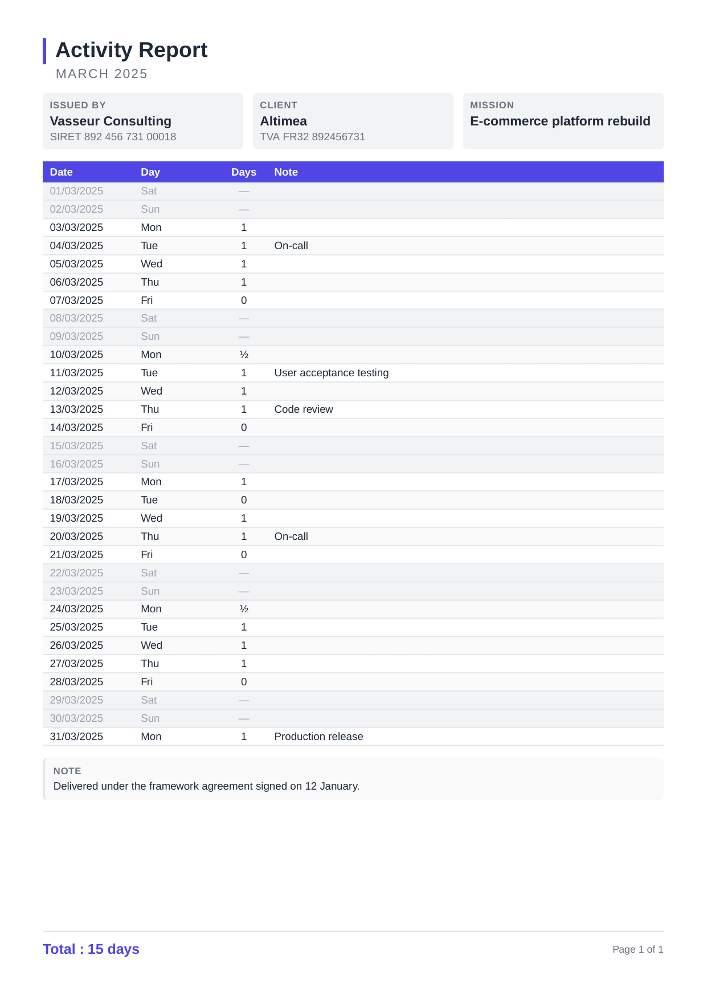
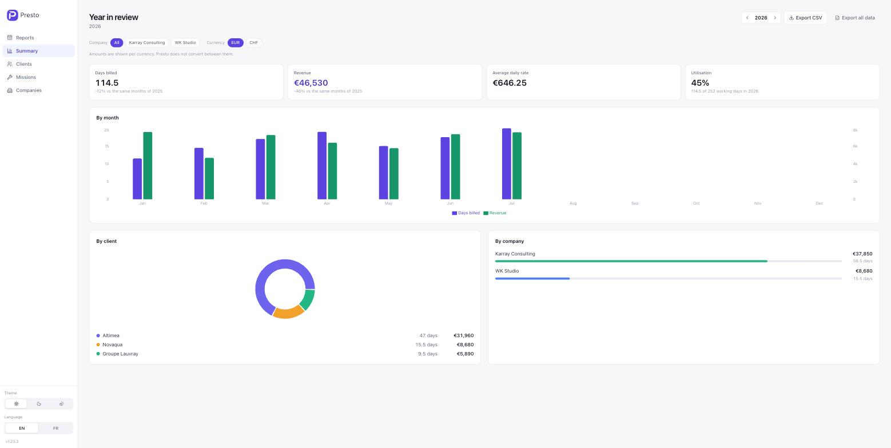

<div align="center">
  
  

  <h3>Monthly activity reports for freelancers and consultants</h3>

  <p>Mark the days you worked on a calendar. Hand your client a clean PDF.<br/>
  One person, one machine, one SQLite file.</p>

  <p>
    <a href="https://github.com/tux86/presto/actions/workflows/ci.yml"></a>
    <a href="https://github.com/tux86/presto/releases"></a>
    <a href="https://hub.docker.com/r/axforge/presto"></a>
    <a href="LICENSE"></a>
  </p>
</div>

<p align="center">
  
</p>

## What it is

A *compte rendu d'activité* generator. Freelancers and consultants bill by the day; at the end of
each month somebody has to produce the document that says which days those were. Presto is that
document, plus the yearly view that tells you how the business is going.

It is built for **one person on one machine**. No accounts, no login, no cloud, no telemetry. Your
data is a single SQLite file you can copy, move and back up yourself.

> [!IMPORTANT]
> **Presto has no authentication.** Anyone who can reach the port can read and change everything.
> Run it on `localhost`, or behind a reverse proxy, VPN or Tailscale that handles access control.
> Do not put it on a public port. See [SECURITY.md](SECURITY.md).

## Quick start

```bash
git clone https://github.com/tux86/presto.git
cd presto
bun install
bun start
```

Open <http://localhost:3001>. That is the whole setup — no database to provision, no `.env` to fill
in. Your data lands in `./data/presto.db`.

The only prerequisite is [Bun](https://bun.sh) 1.2 or newer.

<details>
<summary><b>Docker</b></summary>

```bash
docker run -d --name presto \
  -p 127.0.0.1:8080:8080 \
  -v presto-data:/data \
  ghcr.io/tux86/presto:latest
```

Or with the bundled Compose file:

```bash
curl -O https://raw.githubusercontent.com/tux86/presto/main/docker-compose.yml
docker compose up -d
```

One container, one volume, no database service — because the database is a file. The image is
published to both [GHCR](https://github.com/tux86/presto/pkgs/container/presto) and
[Docker Hub](https://hub.docker.com/r/axforge/presto) for `linux/amd64` and `linux/arm64`, and runs
as a non-root user.

</details>

<details>
<summary><b>Try it with sample data</b></summary>

```bash
bun run seed --reset
```

Two legal entities, four clients across two currencies and about two years of months. Deterministic,
so you get the same data every time. Never runs on its own — Presto has no demo mode.

</details>

## How it works

**Set up once.** Rename the starter company under **Companies** to your legal entity — the name that
appears on the PDF. Add a **client**, which carries its billing currency and its public-holiday
country. Then a **mission** for the work you do for them, with its daily rate.

**Fill in a month.** Create a report for a mission and a month, then:

| | |
|---|---|
| Click a day | cycles it through **empty → half day → full day** |
| **Fill workdays** | marks every weekday, skipping weekends and that client's public holidays |
| **Copy last month** | reuses *which weekdays* you worked, re-applied to this month's calendar |
| <kbd>←</kbd> <kbd>→</kbd> <kbd>↑</kbd> <kbd>↓</kbd> | move · <kbd>Space</kbd> cycles · <kbd>N</kbd> jumps to the day's note |

Public holidays are marked automatically for the client's country, and Presto asks before letting you
bill one. Half days are drawn as a diagonal split, so the shape of a month is readable without
reading any numbers.

<p align="center">
  
</p>

**Send it.** Mark the report **completed** — it becomes read-only — and export the PDF. Reverting to
draft is possible, but Presto asks first, because your client may already have a copy.

Every report has two notes, and the difference matters:

|  | Where it goes |
|---|---|
| **Client note** | printed on the PDF the client receives |
| **Private note** | stays in your database — never in the PDF, never in a client-facing export |

## The PDF

Generated server-side, one page per month, in English or French. It carries your legal entity and
its business ID, the client's, the mission, every day of the month with its notes, public holidays
by name, and the total.

<p align="center">
  
</p>

## The year

Days billed, revenue, average daily rate, and utilisation against the working days in the year —
broken down per client and per legal entity, filterable by either.

A year still in progress is compared against **the same months** of the previous year, not against a
full twelve: eight months of work is not a 40% collapse.

If you bill in more than one currency, amounts are shown **per currency and never converted**. Presto
does not know today's exchange rate and will not pretend to.

<p align="center">
  
</p>

Export the year as **CSV** for your accountant, or the whole database as **JSON** if you want a
format you can read without SQLite.

## Configuration

Everything is optional. Presto runs with no configuration at all.

| Variable | Default | What it does |
|---|---|---|
| `PORT` | `3001` (`8080` in Docker) | HTTP port |
| `DATA_DIR` | `./data` (`/data` in Docker) | where `presto.db` lives |
| `APP_NAME` | `Presto` | name shown in the sidebar and the browser tab |

Theme (light / dark / follow the system), language (English / French) and **privacy mode** are
per-browser settings in the sidebar, not environment variables. Privacy mode blurs every amount —
daily rates, revenue, the summary figures — for screen sharing and screenshots; days, utilisation
and the shape of the charts stay readable.

## Backups

```bash
bun run backup                 # ./backups/presto-YYYY-MM-DD.db
bun run backup /path/to/out.db
```

That file is a complete, self-contained database — copy it to another machine and point `DATA_DIR`
at it to restore.

Presto runs SQLite in WAL mode, so plain `cp data/presto.db` while the server is running can miss
writes still sitting in the log. `bun run backup` uses `VACUUM INTO`, which snapshots under a read
transaction and compacts the result. With Presto stopped, copying the file is fine too.

<details>
<summary><b>From a container</b></summary>

```bash
docker exec presto bun dist/backup.js /data/backup.db
docker cp presto:/data/backup.db ./presto-backup.db
docker exec presto rm /data/backup.db
```

</details>

## Relationship to v1

v2 is a rewrite: PostgreSQL and multi-user accounts are gone, and there is **no automated migration**
from v1. v1 remains available at the [`v1-final`](https://github.com/tux86/presto/tree/v1-final) tag
if you need to get data out of it.

## Development

```bash
bun install
bun run dev            # API on :3001, Vite with HMR on :5173
bun test               # 156 tests, no database or server needed
bun run typecheck
bun run lint:fix
bun run seed --reset   # sample data to work against
bun run backup         # snapshot the database
```

```
src/
  core/    pure logic — calendars, holidays, totals, yearly rollup, CSV
  db/      SQLite schema, migrations, queries
  pdf/     the document your client receives
  server/  Hono routes, static file serving
  ui/      React app
  i18n/    English and French, shared by the UI and the PDF
```

One rule: **`core/` imports nothing from `db/`, `server/`, `pdf/` or `ui/`.** That is what lets the
logic which can actually get an invoice wrong be tested without a database, and it is where nearly
all of the tests point.

Storage is raw SQL against `bun:sqlite`. Migrations are an ordered array of SQL strings in
`src/db/schema.ts`, tracked by `PRAGMA user_version` — append one, never edit one that has shipped.

See [CONTRIBUTING.md](CONTRIBUTING.md) before opening a pull request.

## Stack

Bun · Hono · SQLite · React 19 · Vite · Tailwind CSS 4 · Recharts · @react-pdf/renderer ·
date-holidays · Zod · Biome · TypeScript

## License

[MIT](LICENSE) © [tux86](https://github.com/tux86)
